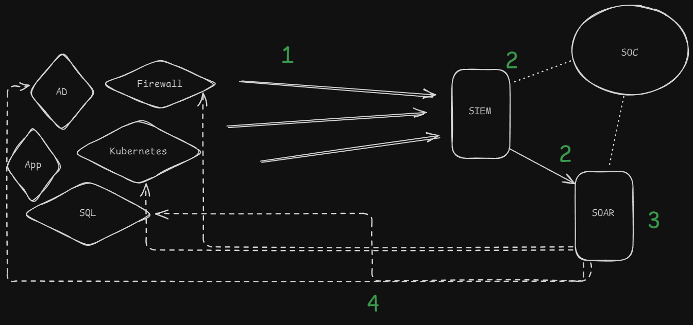
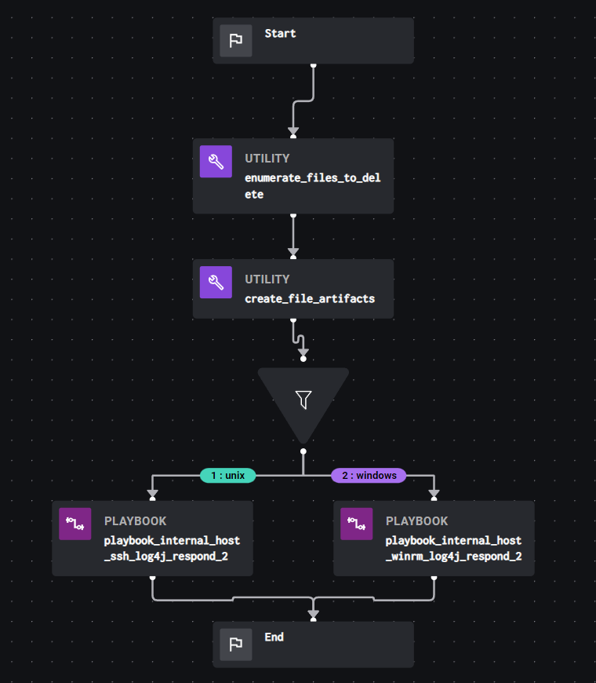

o **SIEM** (Security Information and Event Management) e o **SOAR** (Security Orchestration, Automation and Response) são ferramentas essenciais para a detecção e resposta a incidentes de segurança.

SIEM é uma solução que coleta, correlaciona e analisa logs de segurança de diversos dispositivos e aplicativos em uma organização permitindo identificar padrões de comportamento suspeito, detectar ameaças em tempo real e gerar alertas para a equipe de segurança.

O SOAR complementa o SIEM, automatizando e orquestrando as respostas a incidentes de segurança. Enquanto o SIEM detecta as ameaças, o SOAR executa as ações necessárias para conter e remediar o problema, como bloquear IPs maliciosos, isolar sistemas comprometidos e gerar tickets para a equipe de TI.

## Arquitetura Básica

Estudar estas tecnologias traz consigo uma visão mais estratégica de como funciona as operações de um time de SOC, monitorando, analisando casos, criando novas inteligências e compartilhando informações relevantes.

A arquitetura de um ambiente com SIEM e SOAR ==geralmente== é configurada de acordo com o diagrama abaixo e segue as etapas em sequência:



1) Os ativos de segurança, infraestrutura ou apps enviam logs ao SIEM. A inteligência do SIEM é aplicada utilizando os logs como "matéria prima".
2) A inteligência é aplicada na plataforma do SIEM de acordo com a linguagem de query específica para isso, como regras YARA-L (Google SecOps), SPL (Splunk) ou SIGMA rules. Quando ocorrem detecções, o SIEM notifica o time de SOC e cria casos na plataforma integrada de SOAR.
3) O SOAR atua baseando-se em playbooks ou runbooks para determinar qual ação deve ser tomada para conter o caso.
4) As ações de remediação são enviadas a partir do SOAR para os sistemas dos quais os logs recebidos pelo SIEM surgiram, criando assim um loop de monitoramento, visibilidade e intelligência para o time de SOC.

A partir dessa arquitetura pode-se agregar diversos tipos de serviço e aplicabilidades de recomendações tanto para recebimento de mais logs, melhoria dos playbooks do SOAR, etc...

## Funcionalidades

| SIEM                                   | SOAR                                           |
| -------------------------------------- | ---------------------------------------------- |
| Coleta de Logs e correlação de eventos | Automação de workflows                         |
| Análise Comportamental                 | Orquestração de respostas                      |
| Geração de Alertas                     | Integração com outras ferramentas de segurança |
## Tecnologias OpenSource

Existem projetos como o [Splunk Community](https://community.splunk.com/) e o [Wazuh](https://wazuh.com/) que entregam ótimos recursos presentes em um ambiente de SIEM e podem ser utilizados para iniciar a jornada de conhecimento nesse mundo de Operações de SOC. Para SOAR, existem opções como o [TheHive](https://strangebee.com/thehive/) ou o [Shuffle](https://shuffler.io/).

Com pouco ou nenhum investimento, é possível montar um laboratório para estudar as tecnologias de SOC e entender como o processo de Resposta a Incidentes de segurança deve ser tratado quando colocado em um ambiente empresarial.

Aprofundar seus conhecimentos em SIEM e SOAR é fundamental para qualquer profissional de cibersegurança que busca se destacar no mercado.

## Exemplos de Casos de Uso
### SIEM - **CVE-2009–3898** - Detecção de intrusões

É possível monitorar o ambiente para entender e detectar se algumas vulnerabilidade de aplicação podem estar sendo exploradas. O exemplo abaixo é um regra SIGMA para detectar uma tentativa de exploração de [Path Traversal](https://owasp.org/www-community/attacks/Path_Traversal) para a **CVE-2009–3898** :

```
title: Nginx 0.7.61 - WebDAV Directory Traversal 
status: experimental 
description: Detects a Path Traversal vulnerability in Nginx server because improper limitation  
    of webdav component has to be enabled and the user has to have 
    permission to use the COPY or MOVE methods. 
references: 
  - https://www.exploit-db.com/exploits/9829 
author: Loginsoft Research Unit 
date: 2020/05/27 
tags: 
  - attack.WebDAV Directory Traversal 
logsource: 
  product: webserver 
  vendor: Nginx Plus 
detection: 
  selection: 
    sourcetype : nginx:plus:access 
    uri_path: "*index.html" 
    status: 204 
    http_method:  
      - 'COPY' 
      - 'MOVE' 
  fixdetection: 
    sourcetype : nginx:plus:error 
  fixdetection1: 
    - client sent invalid "Destination" header 
  condition: selection or  fixdetection and fixdetection1 
falsepositives: 
    - Unknown 
level: medium
```
### SOAR - **CVE-2021-44228** - Log4j Respond[](#soar-cve-2021-44228-log4j-respond)

Publicado em resposta ao **CVE-2021-44228**, este playbook pertecen a plataforma Splunk . Neste playbook, o risco de um host explorado pode ser mitigado pela exclusão de arquivos maliciosos dos hosts, bloqueio de conexões de rede de saída dos hosts e/ou desligamento dos hosts da rede.

