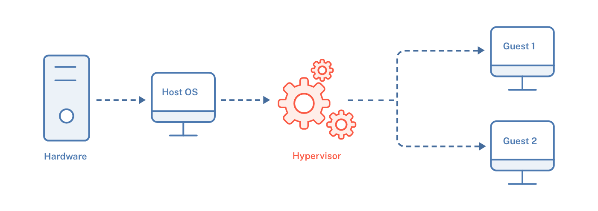
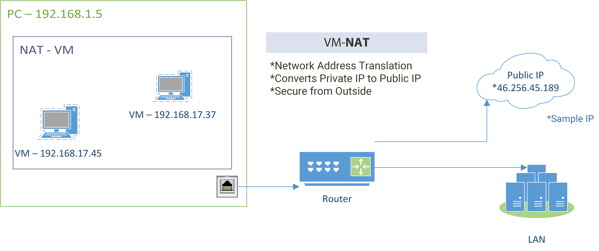
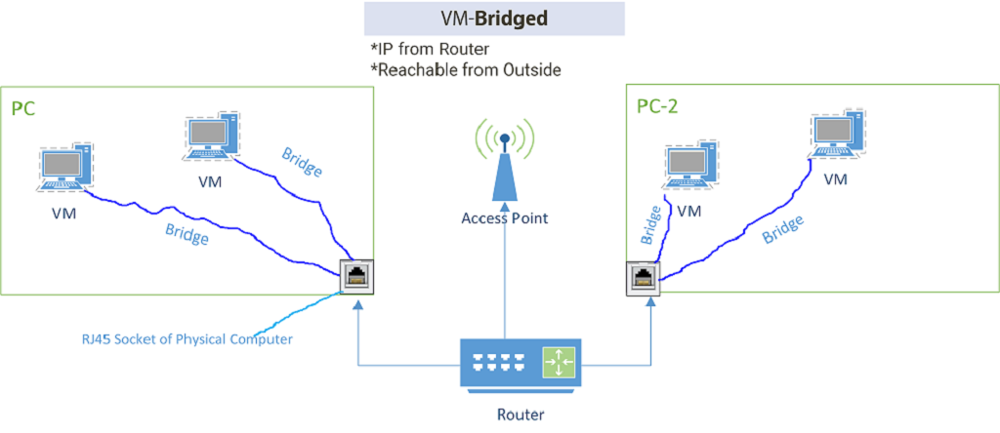
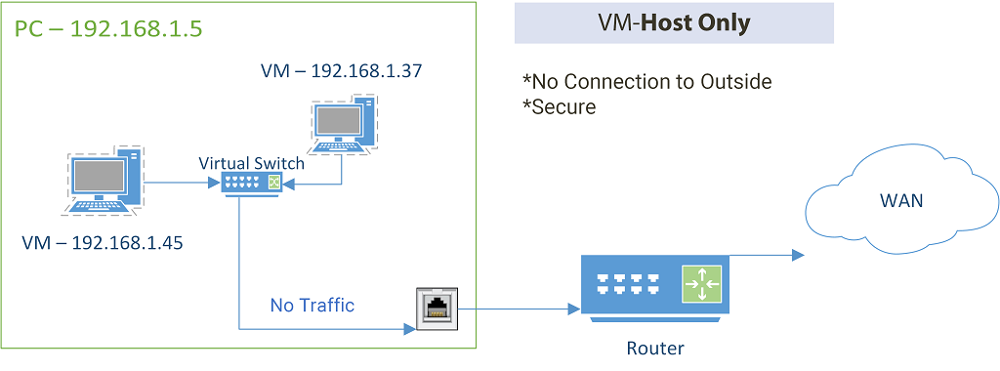


Por que criar um laboratório virtual? 


Essa prática é essencial para quem quer se aprofundar nos conceitos de segurança cibernética sem colocar em risco seus sistemas principais. Um laboratório virtualizado garante o **isolamento** entre os ambientes, simulando um cenário real de empresas que possuam "produção" e "homologação".

Além disso, a **flexibilidade** que um laboratório traz é ideal para os estudos de diferentes cenários, podendo ser utilizado para desenvolvimento, hacking, homologação e vários outros testes e implementações de cenários.

## Escolhendo o hypervisor

Os dois principais softwares utilizados para estes cenários são: [_VmWare_](https://www.vmware.com/products/desktop-hypervisor/workstation-and-fusion) e [_VirtualBox_](https://www.virtualbox.org/)_._ Ambos são softwares de virtualização categorizados como Hypervisors tipo 2, que utilizam de recursos compartilhados com o host para virtualizar os sistemas. O consumo de recursos precisam ser bem dimensionados para que a utilização do ambiente não comprometa o funcionamento do sistema principal.

## Entendendo as Redes Virtuailizadas

É crucial entendermos o tráfego que passa a ser gerado quando trabalhamos com um ou mais sistemas virtualizados. Existem diferentes tipos de configuração que alteram o modo como a comunição _host_ -> _guest_ funciona.

- **NAT:** Permite que a máquina virtual acesse a internet através da rede do seu computador host.
    
  

- **Bridge:** Conecta a máquina virtual diretamente à sua rede física, permitindo que outros dispositivos a vejam.
  
  

- **Host-only:** Isola a máquina virtual da sua rede física, criando uma rede privada.
  
  

## Escolhendo os S.Os

Após a estrutura de rede, podemos começar com a instalação dos sistemas virtualizados. É comum utilizar tecnologias abertas ou open-source nestes casos, principalmente devido à flexibilidade do licenciamento.

**Hacking:** Alguns dos sistemas mais comuns para laboratórios de Cibersegurança são: [Kali Linux](https://www.kali.org/), [Parrot OS](https://parrotsec.org/).

**Desenvolvimento:** Podemos seguir com plataformas mais comuns de mercado, como: [Ubuntu](https://ubuntu.com/download), [AlmaLinux](https://almalinux.org/pt/), [PoP OS](https://pop.system76.com/), [Rocky Linux](https://rockylinux.org/pt-BR/download).

## Estudando ferramentas

Algumas das ferramentas mais utilizadas durante os cenários de testes são:

  **Nmap:** Para varredura de portas e descoberta de hosts.

  **Metasploit:** Framework para exploração de vulnerabilidades e desenvolvimento de exploits.

  **Wireshark:** Para análise de pacotes de rede.

  **Burp Suite:** Para testes de segurança em aplicações web.

  **John the Ripper:** Para quebra de senhas.

*Entre outras*