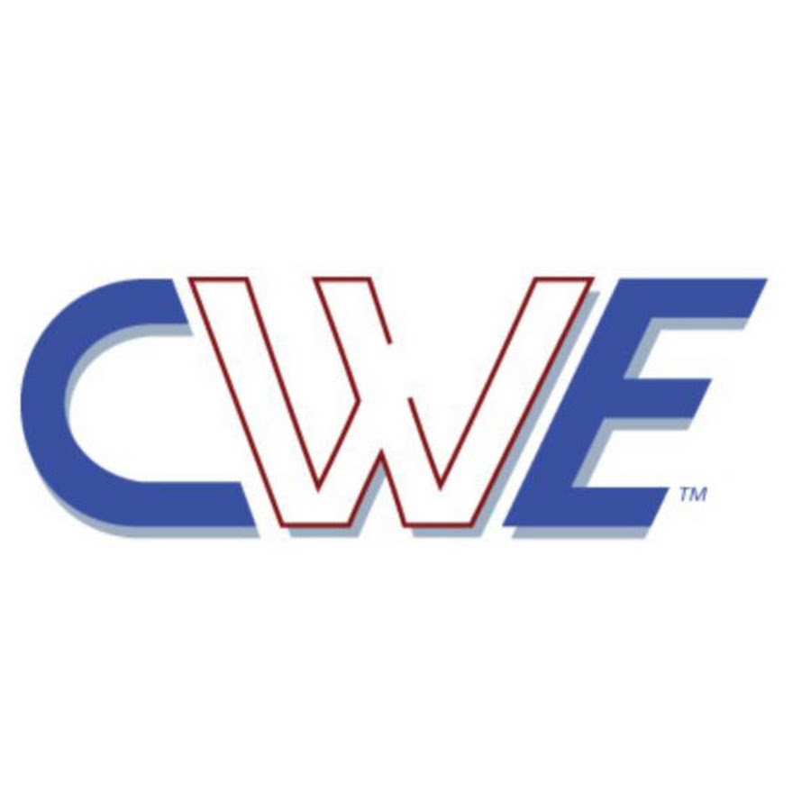

# MITRE Corporation
A MITRE Corporation é uma organização americana sem fins lucrativos que opera Centros de Pesquisa e Desenvolvimento Financiados pelo Governo Federal dos Estados Unidos. Fundada em 1958, sua missão inicial era apoiar o desenvolvimento de sistemas de defesa aérea dos Estados Unidos. Ao longo dos anos, a MITRE expandiu seu escopo para abordar uma ampla gama de desafios complexos nos setores de aviação, defesa, saúde, segurança interna e, crucialmente, segurança cibernética.

Com o crescimento da importância da tecnologia da informação, a MITRE se tornou uma figura central na área de segurança cibernética, trabalhando em estreita colaboração com agências governamentais e a indústria para enfrentar as crescentes ameaças digitais.

## MITRE na Segurança Cibernética:
A MITRE desenvolveu e mantém vários projetos cruciais que se tornaram padrões de facto na indústria de segurança cibernética. Suas principais contribuições incluem:

### CVE (Common Vulnerabilities and Exposures)
O CVE é um sistema de identificação, definição e catalogação de vulnerabilidades de segurança cibernética divulgadas publicamente. Cada vulnerabilidade recebe um identificador único (CVE ID).

Isso fornece uma linguagem comum para discutir e referenciar vulnerabilidades, o que facilita a comunicação entre pesquisadores, fornecedores, usuários e ferramentas de segurança, permitindo uma coordenação mais eficaz na resposta a incidentes e na gestão de vulnerabilidades. É a base para muitos bancos de dados de vulnerabilidades, como o National Vulnerability Database (NVD).

### CWE (Common Weakness Enumeration)
O CWE é um sistema de classificação de tipos de fraquezas de segurança encontradas em softwares e hardwares. Ele organiza essas fraquezas em uma hierarquia, fornecendo um vocabulário comum para descrever as causas das vulnerabilidades.

Enquanto o CVE se concentra em instâncias específicas de vulnerabilidades, o CWE oferece uma visão mais abstrata das fraquezas subjacentes que podem levar a essas vulnerabilidades. Isso ajuda desenvolvedores, arquitetos e analistas de segurança a entenderem as causas raízes dos problemas de segurança e a implementarem práticas de codificação e design mais seguras para prevenir futuras vulnerabilidades.

### ATT&CK (Adversarial Tactics, Techniques, and Common Knowledge)
O ATT&CK é uma base de conhecimento e modelo comportamental para descrever as táticas e técnicas que os adversários cibernéticos usam em diferentes fases de um ataque. Ele organiza essas táticas e técnicas em matrizes, fornecendo um quadro de referência para entender o comportamento do atacante.

O ATT&CK revolucionou a forma como as organizações entendem e se defendem contra ameaças cibernéticas. Ele permite que as equipes de segurança modelem ameaças, desenvolvam melhores detecções, realizem simulações de ataques (red teaming) e melhorem suas estratégias de defesa de forma proativa e informada pela inteligência de ameaças.

### D3FEND Countermeasures
O MITRE DEFEND é um framework que complementa o ATT&CK, focando nas defesas cibernéticas. Ele fornece um modelo estruturado para entender e categorizar as contramedidas que podem ser usadas para mitigar as táticas e técnicas adversárias descritas no ATT&CK.

Enquanto o ATT&CK ajuda a entender o "lado do atacante", o DEFEND oferece um "lado do defensor" correspondente. Ele ajuda as organizações a planejar e implementar defesas mais eficazes, mapeando suas capacidades de segurança para as táticas e técnicas de ataque conhecidas. Isso permite uma abordagem mais estratégica e direcionada para aprimorar a postura de segurança.


  
  
  
  


## Como usamos essas informações no dia a dia?

No dia a dia, é comum ver dashboards com as Táticas e Técnicas do ATT&CK, ou responder a incidentes utilizando os *exploits* mapeados pelo CVE, propor um aumento de maturidade comparando a infraestrutura atual com as medidas do D3FEND.

Alguns exemplos podem ser facilmente notados quando olhamos para algumas ferramentas de mercado:

### Tenable Nessus Scanner

Ao reportar uma vulnerabilidade, o Nessus geralmente inclui o CVE ID. Isso permite que os usuários pesquisem informações adicionais sobre a vulnerabilidade em bancos de dados como o National Vulnerability Database (NVD) ou na própria base de conhecimento da Tenable. Essas informações detalhadas podem incluir a descrição da vulnerabilidade, o impacto potencial, as versões afetadas e as possíveis soluções ou mitigações.

O CVE muitas vezes está associado a uma pontuação de gravidade, como a do CVSS (Common Vulnerability Scoring System). O Nessus leva em consideração essas pontuações (e também possui seu próprio sistema de priorização, o VPR - Vulnerability Priority Rating) para ajudar os usuários a priorizar a correção das vulnerabilidades mais críticas. A presença de um CVE com alta gravidade geralmente indica uma vulnerabilidade que precisa de atenção imediata.

### OWASP ZAP

OWASP ZAP (Zed Attack Proxy) é um poderoso scanner de segurança de aplicações web de código aberto. Embora seu foco principal seja a identificação ativa e passiva de vulnerabilidades através da análise do tráfego web, ele utiliza informações do CWE e alinha-se aos conceitos do ATT&CK. 

Quando o OWASP ZAP identifica uma potencial vulnerabilidade, ele frequentemente tenta categorizá-la de acordo com o CWE. Isso fornece uma maneira padronizada de entender a fraqueza de software subjacente que levou à vulnerabilidade.

### Áreas onde o D3FEND pode influenciar
- **Ferramentas de hardening e configuração de segurança:** Aplicações open source focadas em fortalecer sistemas e aplicações podem começar a incorporar a terminologia e as categorias do D3FEND para descrever as técnicas de hardening implementadas. Por exemplo, uma ferramenta de configuração de firewall poderia referenciar as técnicas de "Network Traffic Filtering" do D3FEND.
- **Sistemas de detecção e resposta a intrusões (IDR/EDR):** Projetos open source nesta área podem utilizar o D3FEND para classificar as capacidades de detecção e as ações de resposta que oferecem, alinhando-as com as táticas de "Detect", "Isolate" e "Evict" do framework.
- **Plataformas de análise de segurança e SIEM:** Ferramentas open source de coleta, análise e correlação de logs de segurança podem usar o D3FEND para descrever as contramedidas que podem ser implementadas com base nos eventos de segurança detectados.
- **Ferramentas de simulação de defesa (Purple Teaming):** Projetos que visam simular cenários de ataque para testar defesas podem usar o D3FEND para planejar e descrever as ações defensivas que serão avaliadas.

É importante notar que a adoção de um framework como o D3FEND leva tempo. À medida que o framework ganha mais reconhecimento e a comunidade compreende melhor seus benefícios para a defesa cibernética, é provável que mais aplicações comecem a incorporar seus conceitos e terminologia.

## Resumo
Aprofundamos nosso conhecimento sobre a MITRE Corporation, a organização por trás de iniciativas chave como o CVE, CWE, ATT&CK e o mais recente D3FEND. Entendemos o contexto histórico da MITRE e como cada um desses frameworks contribui para uma compreensão mais profunda das vulnerabilidades, fraquezas e táticas de ataque, além de fornecer um vocabulário para descrever as defesas.

Exploramos como ferramentas de segurança amplamente utilizadas, como o Tenable Nessus scanner e o OWASP ZAP, integram as informações do CVE, CWE e ATT&CK para identificar, categorizar e contextualizar as vulnerabilidades, auxiliando profissionais de segurança a protegerem seus sistemas e aplicações de forma mais eficaz.s

E por falar em defesas cibernéticas... Como as organizações estão realmente implementando as estratégias de defesa baseadas nesses frameworks? Quais são os desafios e as melhores práticas na construção de uma fortaleza digital resiliente? E como o promissor framework D3FEND pode revolucionar a forma como pensamos e aplicamos a segurança defensiva no futuro?...